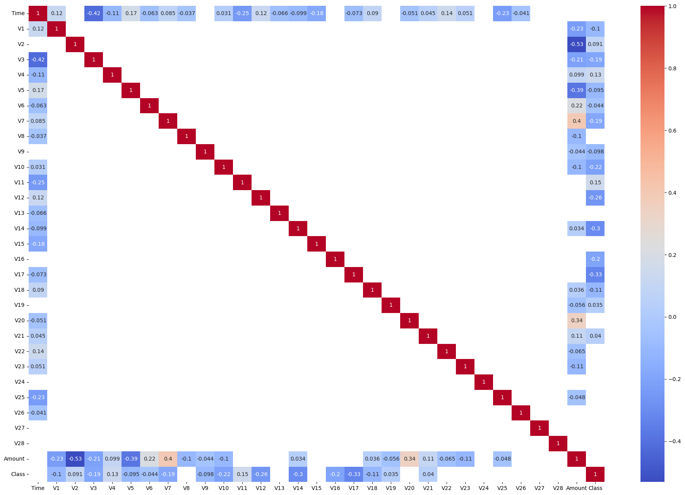
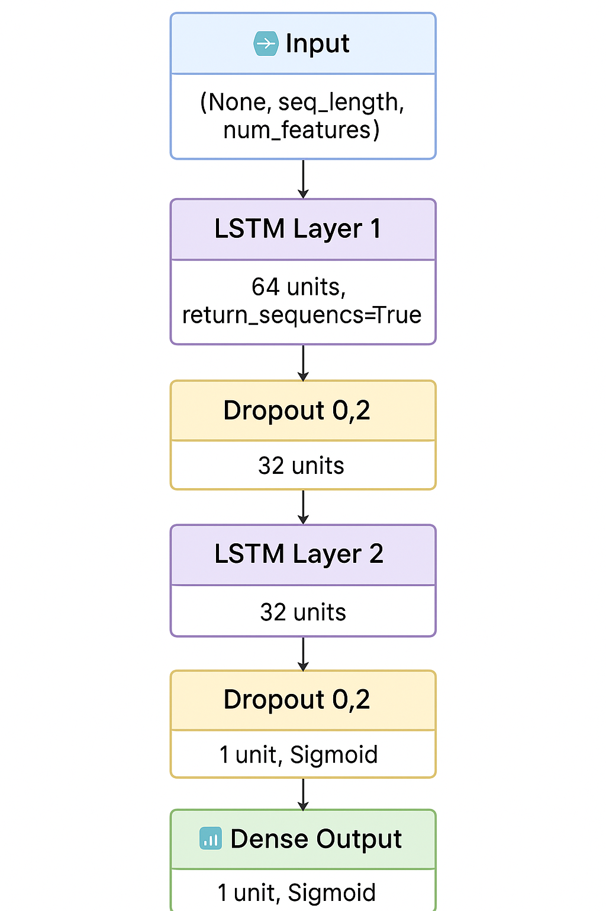

# Relatório Gerencial — Implementação de Rede Neural LSTM para Detecção de Fraudes

Este documento apresenta um resumo gerencial do notebook [`Ponderada_ErikRafaYan.ipynb`](Ponderada_ErikRafaYan.ipynb), detalhando as etapas, decisões técnicas e resultados obtidos na atividade de implementação de uma rede neural LSTM (Long Short-Term Memory) para detecção de fraudes em transações financeiras utilizando o dataset IEEE-CIS Fraud Detection.

## Objetivo e Fundamentação Conceitual

Atividade tem como objetivo central desenvolver um modelo de rede neural LSTM capaz de detectar fraudes em transações financeiras, explorando fundamentalmente as características temporais inerentes aos dados transacionais. A escolha da arquitetura LSTM foi motivada pela necessidade de capturar dependências temporais de longo prazo nos padrões de comportamento fraudulento, algo que modelos tradicionais de redes neurais densas não conseguem realizar eficientemente.

As redes LSTM representam uma evolução das redes neurais recorrentes tradicionais, sendo especificamente projetadas para resolver o problema do desvanecimento do gradiente que afeta modelos sequenciais profundos. Esta capacidade de "memória" permite ao modelo identificar padrões fraudulentos que se manifestam ao longo de sequências temporais de transações, considerando não apenas as características individuais de cada transação, mas também o contexto histórico que a precede.

## Metodologia e Desenvolvimento da atividade

### Configuração Inicial e Aquisição dos Dados

O desenvolvimento da atividade iniciou-se com a configuração do ambiente computacional necessário para processamento de redes neurais profundas, incluindo a instalação de bibliotecas especializadas como TensorFlow, Keras-Tuner e ferramentas de visualização. O dataset IEEE-CIS Fraud Detection foi obtido através de um sistema de download automatizado, resultando em um conjunto de dados de 151MB contendo informações sobre transações financeiras já pré-processadas.

A estrutura do dataset reflete uma abordagem cuidadosa de proteção da privacidade, onde as variáveis originais foram transformadas através de técnicas de anonimização, resultando em features denominadas V1 a V28. Além destas, o dataset mantém duas variáveis em sua forma original: Time, que representa a dimensão temporal crucial para nossa análise sequencial, e Amount, que indica o valor monetário das transações. A variável alvo Class distingue entre transações legítimas e fraudulentas.

### Exploração e Compreensão dos Dados

A análise exploratória revelou características fundamentais que influenciariam diretamente as decisões de modelagem subsequentes. A investigação das distribuições através de histogramas evidenciou que as variáveis V1-V28 já haviam passado por processos de normalização, apresentando distribuições centradas e com variâncias controladas. Esta descoberta foi crucial pois eliminou a necessidade de normalização adicional para essas features, permitindo que o foco fosse direcionado para as variáveis Time e Amount, que apresentavam escalas significativamente diferentes.

O desequilíbrio entre classes emergiu como um desafio central da atividade, espelhando padrões típicos encontrados em problemas de detecção de fraude no mundo real. A distribuição assimétrica, onde transações fraudulentas representam uma fração mínima do total, demandou a implementação de estratégias específicas de balanceamento e métricas de avaliação apropriadas para cenários de classes desbalanceadas.

A análise de correlação, implementada através de mapas de calor com threshold de 0.03 para visualização de relações significativas, revelou que várias variáveis, incluindo Time e diversas features da série V, apresentavam correlações fracas com a variável alvo. Esta descoberta sugere que a identificação de fraudes neste dataset requer a captura de padrões complexos e não-lineares, justificando ainda mais a escolha de arquiteturas de deep learning.

A presença generalizada de outliers, identificada através de análise de boxplots, indicou a necessidade de tratamento cuidadoso durante o pré-processamento. Em contextos de detecção de fraude, outliers podem representar tanto comportamentos fraudulentos genuínos quanto ruído nos dados, exigindo uma abordagem balanceada que preserve informações relevantes enquanto remove distorções prejudiciais ao treinamento.

### Pré-processamento Adaptado para Modelagem Sequencial

O pré-processamento dos dados foi cuidadosamente redesenhado para atender às demandas específicas das redes neurais recorrentes, particularmente considerando a natureza temporal inerente às arquiteturas LSTM. Esta etapa representou um dos maiores desafios conceituais da atividade, pois diferentemente de modelos tradicionais que tratam cada observação independentemente, o LSTM requer uma estruturação sequencial que preserve a ordem cronológica dos eventos.

A separação temporal dos dados constituiu o primeiro passo crítico neste processo. Reconhecendo que a aleatoriedade típica da divisão treino-teste poderia destruir as dependências temporais essenciais para o aprendizado do LSTM, optou-se por uma abordagem sequencial rigorosa. Os dados foram ordenados cronologicamente através da variável Time, e posteriormente divididos em blocos contíguos: 75% para treinamento (217.878 observações), 10% para validação (24.208 observações) e 15% para teste (42.721 observações). Esta estratégia garante que o modelo seja treinado com dados históricos e avaliado com eventos futuros, simulando cenários reais de produção.

O tratamento de outliers demandou consideração especial no contexto de detecção de fraudes. Utilizando o método do intervalo interquartil (IQR) com fator 1.5, implementou-se uma função que remove observações extremas sem comprometer a identificação de padrões fraudulentos legítimos. A decisão de aplicar esta limpeza apenas ao conjunto de treinamento reflete a necessidade de preservar a integridade dos dados de validação e teste, mantendo suas características distributivas originais.

A normalização foi estrategicamente limitada à variável Amount, reconhecendo que as demais features já apresentavam escalas apropriadas. Esta decisão evita distorções desnecessárias que poderiam prejudicar o aprendizado do modelo. A implementação incluiu o salvamento dos parâmetros de normalização do conjunto de treinamento, garantindo consistência na aplicação aos dados de validação e teste. Além disso, grande parte dos valores de amount estão entre 0 e 1, mas também há valores mais altos. Com isso, normalizar esses dadso se torna importante para que dados com amount mais alto não causem uma espécie de overfitting.

A transformação mais significativa envolveu a criação de sequências temporais através do TimeseriesGenerator. Com janelas de 30 passos temporais, cada entrada do modelo passou a representar não uma transação isolada, mas uma sequência de 30 transações consecutivas. Esta abordagem permite ao LSTM identificar padrões de comportamento que emergem ao longo do tempo, capturando sutilezas temporais que seriam invisíveis em análises pontuais. O resultado foi um conjunto de treinamento com 2.482 batches, cada um contendo múltiplas sequências de 30 transações.

### Concepção e Implementação da Arquitetura LSTM

A arquitetura do modelo foi concebida seguindo princípios de design hierárquico, onde cada camada desempenha um papel específico na extração e processamento de informações temporais. A estrutura resultante reflete um equilíbrio cuidadoso entre capacidade de aprendizado e prevenção de overfitting, características essenciais para o sucesso em problemas de detecção de fraude.

A primeira camada LSTM, configurada com 64 neurônios e habilitada para retornar sequências completas (return_sequences=True), atua como um extrator primário de características temporais. Esta configuração permite que a camada processe toda a sequência de entrada e passe informações temporais refinadas para camadas subsequentes. O número de neurônios foi dimensionado para proporcionar capacidade suficiente de captura de padrões complexos sem incorrer em custos computacionais excessivos.

A inserção da primeira camada de Dropout com taxa de 0.2 representa uma estratégia fundamental de regularização. Esta técnica, que desativa aleatoriamente 20% dos neurônios durante o treinamento, força o modelo a desenvolver representações mais robustas e generalizáveis, reduzindo significativamente o risco de overfitting em um domínio onde a generalização é crucial.

A segunda camada LSTM, com 32 neurônios e sem retorno de sequências, funciona como um mecanismo de condensação de informações temporais. Esta camada recebe as representações temporais da primeira camada e as transforma em um vetor de características fixo, preparando os dados para a classificação final. A redução no número de neurônios reflete uma arquitetura em funil, onde a complexidade dimensional é gradualmente reduzida.

A segunda camada de Dropout mantém a mesma taxa de regularização, garantindo consistência na prevenção de overfitting ao longo de toda a arquitetura. A camada densa final, com um único neurônio e ativação sigmoid, transforma as representações aprendidas em probabilidades de classificação binária, apropriadas para o problema de detecção de fraude.

### Sistema de Avaliação Multidimensional

O sistema de métricas foi especificamente projetado para abordar os desafios inerentes aos problemas de classificação com classes desbalanceadas. Reconhecendo que a acurácia tradicional pode ser enganosa em cenários onde a classe majoritária domina numericamente, implementou-se um conjunto abrangente de métricas que capturam diferentes aspectos do desempenho do modelo.

A precisão (Precision) mede a proporção de predições positivas que são verdadeiramente positivas, sendo crucial para minimizar falsos alarmes em sistemas de detecção de fraude. O recall quantifica a capacidade do modelo de identificar todas as instâncias fraudulentas, sendo fundamental para garantir que fraudes reais não passem despercebidas. A área sob a curva ROC (AUC-ROC) fornece uma medida global da capacidade discriminativa do modelo, enquanto a área sob a curva de Precision-Recall (AUC-PR) oferece uma avaliação mais sensível ao desbalanceamento de classes.

### Estratégia de Treinamento e Balanceamento

O processo de treinamento incorporou técnicas avançadas de balanceamento de classes através do uso de pesos diferenciados (class weights). Esta abordagem calcula automaticamente pesos inversamente proporcionais à frequência das classes, garantindo que o modelo atribua importância adequada aos exemplos da classe minoritária (fraudes) durante o processo de otimização.

O treinamento foi executado por 25 épocas, período suficiente para permitir convergência sem incorrer em overfitting excessivo. A implementação de callbacks de salvamento de modelo (ModelCheckpoint) garante que apenas a melhor versão do modelo, baseada na loss de validação, seja preservada. Esta estratégia é particularmente importante em problemas de detecção de fraude, onde a performance em dados não vistos é crucial para a aplicabilidade prática do sistema.

### Análise Integral dos Resultados e Interpretação dos Padrões

A implementação de um sistema abrangente de visualização permitiu uma análise multifacetada do comportamento do modelo durante o treinamento. A função de plotagem desenvolvida gera uma série de gráficos que rastreiam a evolução temporal das métricas fundamentais, incluindo loss de treino e validação, precisão, recall, F1-score derivado, e as áreas sob as curvas ROC e Precision-Recall. Esta abordagem visual facilita a identificação de padrões de aprendizado, tendências de convergência e potenciais sinais de overfitting ou underfitting.

### Diagnóstico de Performance e Identificação de Limitações

A análise das curvas de aprendizado evidencia que o modelo atinge **perda de treino praticamente nula logo nas primeiras épocas**, o que demonstra uma rápida capacidade de memorizar o conjunto de treinamento. Entretanto, a **perda de validação sobe gradualmente até se estabilizar em torno de 0,095**, caracterizando um caso claro de **overfitting**. Isso sugere que a complexidade atual da rede é alta para o tamanho e a variabilidade do conjunto de dados, permitindo que o modelo memorize padrões específicos em vez de aprender generalizações robustas.

Ao avaliar as métricas de desempenho, percebe-se que **a precisão no treino é praticamente nula**, enquanto na validação apresenta apenas um pequeno crescimento, saindo de aproximadamente 0,0036 para 0,0042. Esse comportamento indica que o modelo **não está aprendendo a identificar corretamente as classes positivas**, provavelmente prevendo a classe majoritária na maior parte das instâncias. Esse viés é confirmado pelo **recall**, que se mantém constante em torno de 0,11 ao longo de todo o treinamento, reforçando que poucas amostras positivas são detectadas.

O **F1-score**, que combina precisão e recall, apresenta valores extremamente baixos, variando apenas de 0,007 para 0,008 — evidenciando baixa capacidade discriminativa. As curvas de **AUC-ROC** e **AUC-PR** também reforçam esse diagnóstico: embora a AUC-ROC tenha um leve aumento de \~0,50 para \~0,54, indicando um desempenho apenas marginalmente melhor que um classificador aleatório, a AUC-PR permanece em valores muito baixos (\~0,0018 para \~0,0019), o que é crítico para datasets desbalanceados, já que essa métrica mede a qualidade da separação entre classes raras e majoritárias.

Esses resultados mostram que o modelo **não está generalizando bem** e apresenta dificuldade significativa em separar casos positivos de negativos. As principais limitações identificadas estão associadas ao **desbalanceamento das classes**, à **falta de representatividade nas features** e possivelmente a uma **arquitetura superparametrizada** para o tamanho do dataset. Além disso, o crescimento quase inexistente das métricas de desempenho ao longo das épocas indica que há **pouco aprendizado efetivo após as primeiras iterações**, sugerindo a necessidade de revisar a função de perda, as métricas de avaliação e a preparação dos dados para garantir que a rede esteja recebendo informações úteis para o treinamento.
